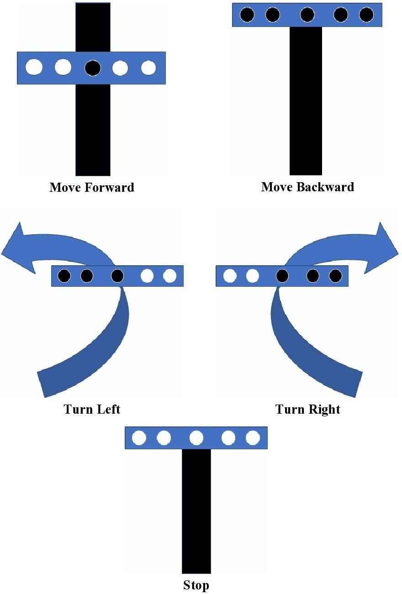
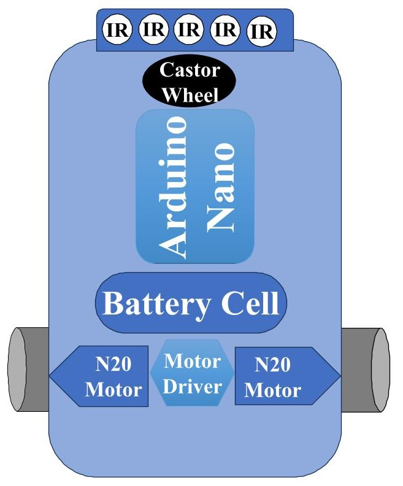
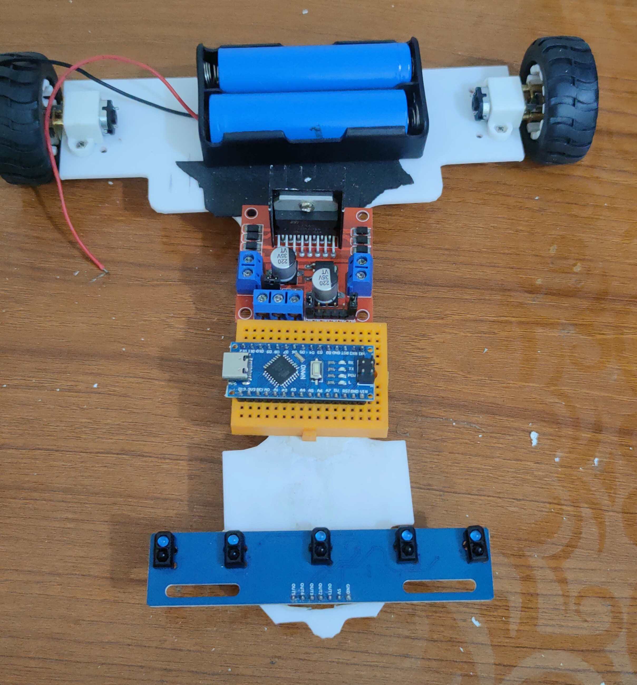
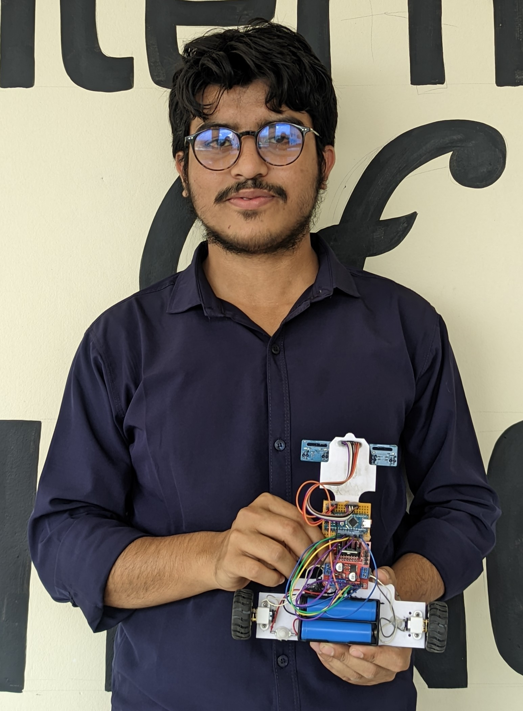
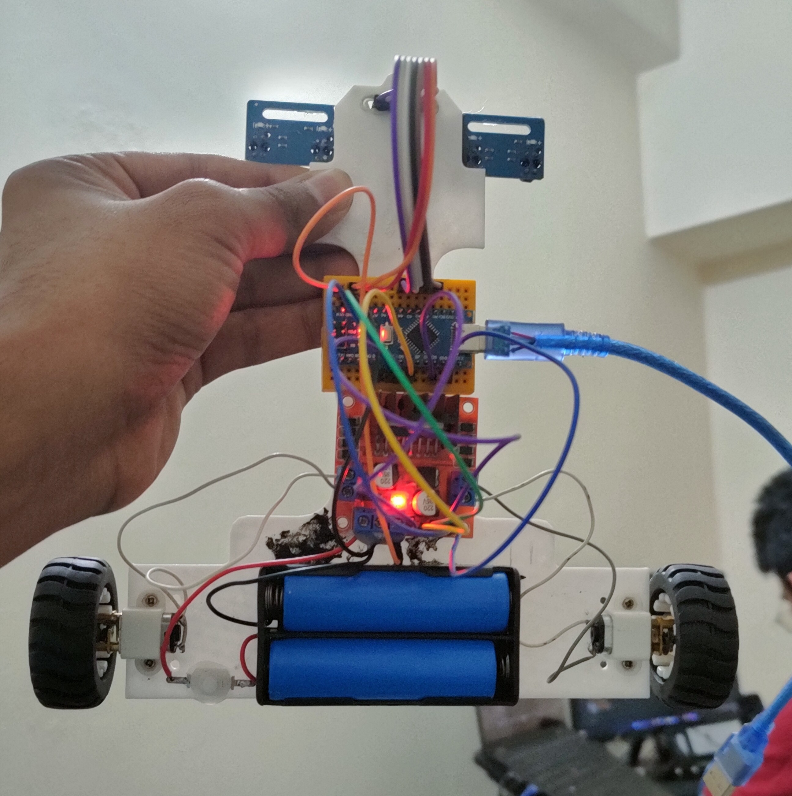

<div align="center">

# 🤖 Line Follower Robot (LFR)

**An autonomous Arduino-based robot that tracks a black line on a white surface using IR sensors and PID control**


</div>

---

## 📖 Overview

The **Line Follower Robot (LFR)** is an autonomous mobile robot that detects and follows a black line on a contrasting white surface using a 5-array IR sensor module. An **Arduino Nano (ATmega328P)** reads the sensor data and drives two N20 DC gear motors through a motor driver, using a **PID (Proportional–Integral–Derivative)** control approach for smooth, stable navigation — including straight paths, curves, and turns.

The project was built as a hands-on demonstration of embedded systems and control theory, with real-world applications in industrial material transport, warehouse automation, autonomous indoor delivery (e.g., office document/file transport), and educational robotics.

This repository contains the source code and design assets for the robot. The full academic project report (methodology, literature review, socio-economic analysis, and results) is included under `docs/`.

---
📄 **Full Project Report:** [Line Follower Robot — Project Report (ResearchGate)](https://www.researchgate.net/publication/385796819_Project_Report_on_Line_Follower_Robot_A_System_Design_Using_Microcontroller)

## Supervisor
**Alimul Rajee**   
Lecturer, Department of Information & Communication Technology, Comilla University

## ✨ Features

- 🛣️ **Autonomous Line Tracking** — Follows a black line on a white surface using reflectance-based IR sensing
- 🎛️ **PID Control** — Smooth, stable navigation with proportional, integral, and derivative correction (vs. jerky ON-OFF control)
- ↩️ **Turn Detection** — Handles left turns, right turns, and dead ends with a minimal 5-sensor array
- 🛑 **Automatic Stop** — Detects the end of the path and halts safely
- 🧩 **Low-Cost, 3D-Printed Build** — Custom-printed chassis housing all electronics and mechanical parts
- 🔋 **Battery-Powered** — Fully self-contained, untethered operation

---

## 🛠️ Hardware / Components

| Component | Role | Qty |
|---|---|---|
| **Arduino Nano** (ATmega328P) | Main microcontroller — reads sensors, runs control logic, drives motors | 1 |
| **5-Array IR Sensor Module** | Detects black line vs. white surface via IR reflectance | 1 |
| **N20 DC Gear Motor** (600+ RPM) | Drives the wheels | 2 |
| **Motor Driver** | Converts Arduino control signals into motor drive current | 1 |
| **Mini Wheel** | Driven by the N20 motors for forward/backward motion | 2 |
| **Castor Wheel** | Passive wheel that enables smooth turning | 1 |
| **3D-Printed Chassis** | Houses all electronic and mechanical components | 1 |
| **Battery Cell** | Powers the Arduino and motor driver | 1 |

---

## 🧠 Control Logic

The robot reads all 5 IR sensors (**IR1–IR5**, left to right) on every loop cycle and decides its next action:

| Sensor Pattern | Action | Motor Behavior |
|---|---|---|
| Only **IR3** (center) on black | **Forward** | Both motors: same speed, clockwise |
| **IR1, IR2, IR3** on black | **Turn Left** | Left motor slows, right motor spins clockwise |
| **IR3, IR4, IR5** on black | **Turn Right** | Right motor slows, left motor spins clockwise |
| **All (IR1–IR5)** on black | **Backward** (dead end) | Both motors: same speed, anti-clockwise |
| **All (IR1–IR5)** on white | **Stop** (end of path) | Both motors halted |

### Control Algorithm — PID

A **PID controller** continuously computes the error between the robot's actual position and the line, then corrects motor speeds in real time:
- **Proportional (P)** — reacts to the current error, steering the robot back toward the line
- **Integral (I)** — accumulates past error to correct small, persistent drift (e.g., sensor misalignment)
- **Derivative (D)** — anticipates future error from the rate of change, smoothing sharp turns and reducing overshoot

This produces smoother, more energy-efficient navigation than simple ON-OFF control, especially on curves and irregular paths.

---

## 🔄 Control Logic


---

## 🧩 Flow Chart


---

## 🖼️ System Architectur


---
## 🎥 Images
### Main  Structure


### Individuals


### Team Members
**Ahsan Habib**  
**Nigar Sultana**  
**Sharmin Ahmed Rima** |
**Mohammad Rifatul Islam Marof**  
**Shahriar Nafis Joy**  


## 🎥 Functional Video
[](Assets/Functional.mp4)

---

## 🚀 Getting Started

### Prerequisites
- [Arduino IDE](https://www.arduino.cc/en/software)
- Arduino Nano board driver (CH340/FTDI, depending on your board revision)
- Hardware listed in [Components](#️-hardware--components), assembled per the [Block Diagram](#-block-diagram)

### Setup
```bash
# 1. Clone the repository
git clone https://github.com/<your-username>/LineFollowerRobot.git
cd LineFollowerRobot
```

2. **Wire the hardware**
   - Connect the 5-array IR sensor outputs to Arduino Nano analog/digital input pins.
   - Connect the motor driver inputs to Arduino Nano PWM/digital output pins.
   - Connect the motor driver outputs to the two N20 gear motors.
   - Power the Arduino and motor driver from the battery cell.

3. **Upload the code**
   - Open the `.ino` sketch in Arduino IDE.
   - Select **Board: Arduino Nano** and the correct **Port**.
   - Click **Upload**.

4. **Calibrate & Run**
   - Place the robot on the black line and power it on.
   - Adjust the IR sensor darkness threshold and PID gains (`Kp`, `Ki`, `Kd`) in the code as needed for your track's lighting and surface conditions.

---

## 📁 Project Structure

```
LineFollowerRobot/
├── src/               # Arduino sketch(es) / control logic source
├── Assets/            # Figures, diagrams, photos, and demo video
├── README.md
├── CONTRIBUTING.md
└── LICENSE
```

---

## 🏭 Applications

- **Industrial** — Autonomous transport of materials along production floors, reducing labor costs and manual handling
- **Educational Robotics** — A practical, beginner-friendly platform for teaching sensors, control systems, and microcontroller programming
- **Autonomous Indoor Delivery** — Transporting documents, files, or medical supplies within offices and hospitals along fixed routes
- **Warehouse Automation** — Moving goods to and from storage locations with improved precision and reduced reliance on manual labor

## 🔭 Future Work

- Higher-resolution optical/IR sensors for improved navigation on complex routes
- Ultrasonic or LiDAR-based obstacle detection while remaining on the designated path
- GSM module integration for real-time remote monitoring
- Battery life optimization via power management and rechargeable/energy-harvesting sources
- GPS integration for larger-area navigation
- Advanced control via machine learning-based navigation, beyond classical PID

---

## 🤝 Contributing

Contributions and improvements are welcome! Please see [CONTRIBUTING.md](CONTRIBUTING.md) before opening an issue or pull request.

---

## 📜 License

This project is licensed under the [MIT License](LICENSE).

---
## 👤 Author

**Mohammad Rifatul Islam Marof**
ICT Graduate, Comilla University
📄 [Project Report on ResearchGate](https://www.researchgate.net/publication/385796819_Project_Report_on_Line_Follower_Robot_A_System_Design_Using_Microcontroller)
🔗 [GitHub](https://github.com/rifat-cou)

